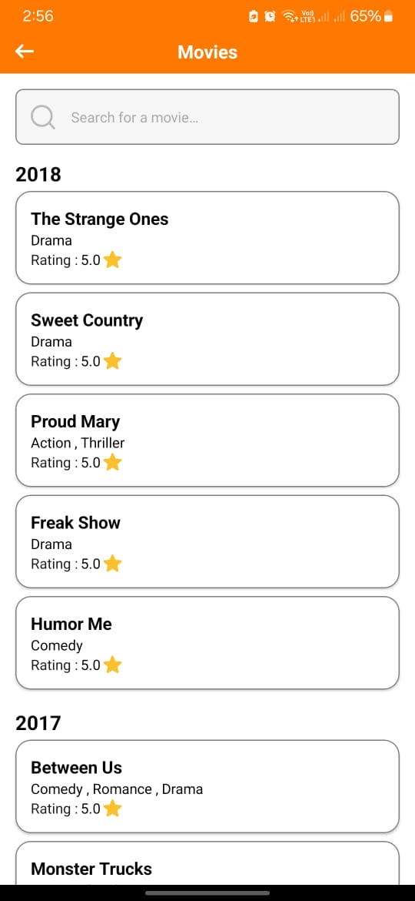
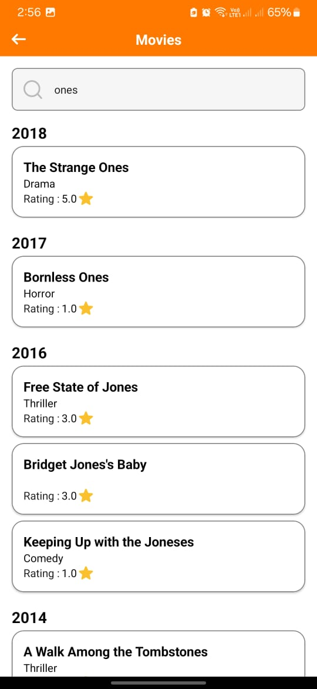
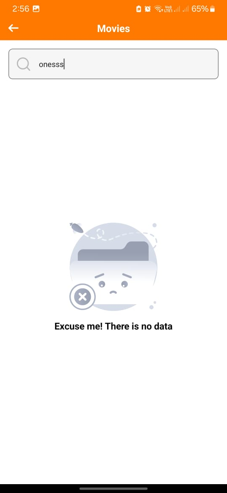
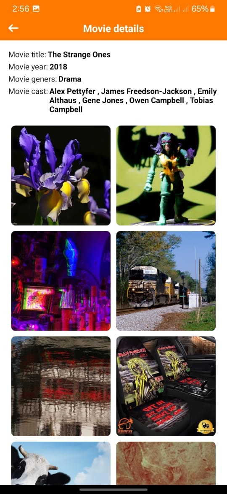
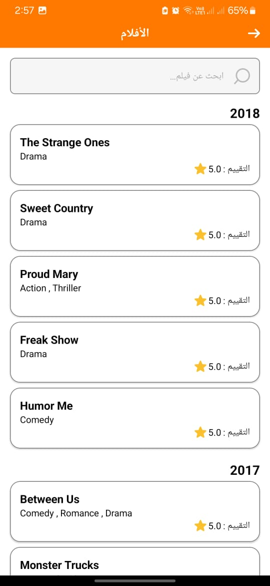

# Flickers-App

## Overview

Flickers-App is a movie browsing application that allows users to search for movies, view details, and see related flickers (photos). The app categorizes movies by year and sorts them based on their ratings. The app is built using modern Android development practices including MVVM architecture, Jetpack components, and Dependency Injection with Hilt.

## Download
You can download the latest versions of the app from the following links:
- [Staging Version](https://install.appcenter.ms/users/eslamemad/apps/flickers-app/distribution_groups/stg)
- [Live Version](https://install.appcenter.ms/users/eslamemad/apps/flickers-app/distribution_groups/live)

## Features

- Search for movies by title
- View detailed information about a selected movie
- Browse movies categorized by year
- View movie-related flickers (photos)

## Architecture

The app follows the MVI (Model-View-Intent) architecture pattern and is divided into several modules:

1. **Domain Module**: Contains the business logic and use cases. This module is a plain Kotlin library and does not depend on Android framework classes.
2. **Data Module**: Manages data sources (e.g., remote APIs, local database) and repositories.
3. **Presentation Module**: Contains the UI components, ViewModels, and their interactions.

## Project Structure

- `domain`: Contains use cases, entities, and repository interfaces.
- `data`: Implements the repositories and data sources (e.g., network and local).
- `presentation`: Contains the UI components and ViewModels.

## Dependencies

### Version Catalog

Using a version catalog helps to manage dependencies in a centralized manner, making it easier to update and maintain consistent versions across the project.

### Key Dependencies

- Kotlin Coroutines for asynchronous programming
- Hilt for dependency injection
- Jetpack components like LiveData, ViewModel, Navigation
- Retrofit for network calls
- Fastlane for continuous deployment

## Installation

1. **Clone the repository**:
    ```sh
    git clone https://github.com/EslamEmad99/Flickers-App.git
    cd Flickers-App
    ```

2. **Open the project in Android Studio**.

3. **Build the project**:
    Ensure you have the latest version of Android Studio and the necessary SDKs installed. Sync the project with Gradle files to download all dependencies.

4. **Run the app**:
    Connect an Android device or start an emulator and run the app from Android Studio.

## Usage

### Running Tests

To run the unit tests, execute the following command:

```sh
./gradlew test
```

### Running Fastlane

To deploy the app using Fastlane, you need to set up Fastlane and Ruby first if you want to use it in the project. Then run these two commands:

```sh
fastlane init
bundle exec fastlane add_plugin appcenter
```
Feel free to use the app without using Fastlane.

## Screenshots








## License
This project is licensed under the MIT License. See the [LICENSE](LICENSE) file for more details.

## Contributing
We welcome contributions! Please read the [CONTRIBUTING](CONTRIBUTING.md) guidelines before submitting a pull request.

## Contact
For any questions or feedback, feel free to reach out to the project maintainer:

- **Name:** Eslam Emad
- **Email:** [eslamemad903@gmail.com](mailto:eslamemad903@gmail.com)
